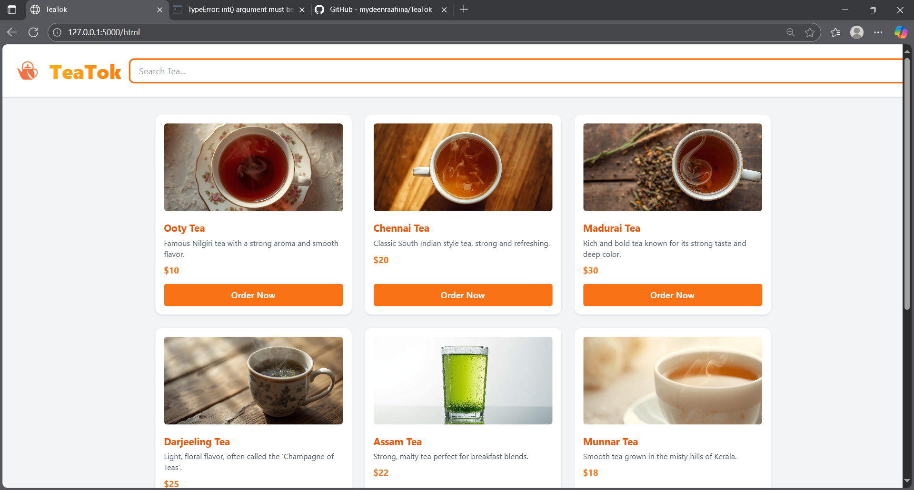
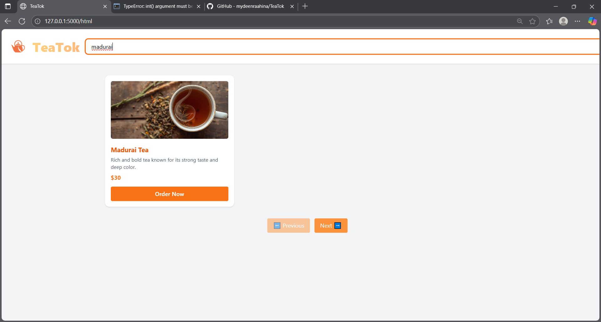
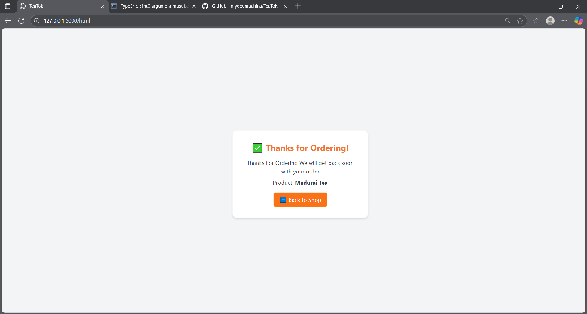

# TeaTok – Simple Tea Ordering Backend

**TeaTok** is a simple Flask backend project to practice routes, GET requests, JSON responses, searching, and pagination.

This project demonstrates a functional backend for a tea ordering site, including product listing, search, and dummy order confirmation.

---

## Features

- **View Products** – Paginated listing of tea products (8 per page).  
- **Search Products** – Search teas by name using a query parameter.  
- **Order Tea (Dummy)** – Click “Order Now” to see a confirmation message.  
- **Backend Focus** – GET routes, query parameters, JSON responses, loops, and conditionals.

---

## Backend Routes

| Route              | Method | Description |
|-------------------|--------|-------------|
| `/`                | GET    | Returns paginated products (`?page=1`) |
| `/html`            | GET    | Renders the frontend HTML |
| `/click`           | GET    | Dummy order endpoint (returns confirmation message) |
| `/search`          | GET    | Search products by name (`?products_name=Ooty Tea`) |

---

## Screenshots

### Homepage

### Search Results

### Order Confirmation

---

## Technologies

- **Backend:** Python, Flask  
- **Data:** Static Python list of products  

---

